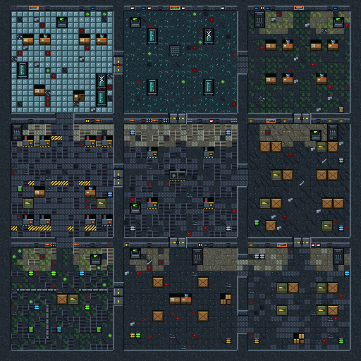

# PROJECT: NIGHTFALL

**An original endless top-down zombie-survival shooter for the Game Boy Advance.**

You are *Rook*, the last member of an emergency response team, trapped in
**BLACKSITE 13** – an abandoned experimental military research facility whose
biological power source, *the Nightfall Core*, has reanimated the dead.
There is no final level. The objective is **SURVIVE**.



Everything in the repository is original: code, pixel art, level, music and
sound effects are all generated or written from scratch for this project (see
[Originality](#originality)). The game is written in C against a tiny hand-made
hardware layer – **no libgba / devkitPro required**, just `arm-none-eabi-gcc`.

| | |
|---|---|
| Platform | Nintendo Game Boy Advance (ARM7TDMI, 240×160, 15-bit colour, 60 FPS) |
| ROM size | ~115 KB (`nightfall.gba`) |
| Save | 32 KB SRAM (settings + high scores) |
| Language | C11 (+ ~100 lines of ARM assembly), Python 3 tooling |

---

## Quick start

```sh
# 1. toolchain (Debian / Ubuntu)
sudo apt install gcc-arm-none-eabi binutils-arm-none-eabi libnewlib-arm-none-eabi make python3 python3-pil

# 2. build
make                 # -> nightfall.gba

# 3. play (any GBA emulator; mGBA recommended)
mgba nightfall.gba
```

A ready-built ROM (`nightfall.gba`) is checked in so you can try the game
without building anything.

### Build variants

| command | output | what it is |
|---|---|---|
| `make` | `nightfall.gba` | release build |
| `make DEBUG=1` | `nightfall_debug.gba` | debug overlay, profiler, cheats (see [Debug mode](#debug-mode)) |
| `make BOT=1` | `nightfall_bot.gba` | self-playing, immortal stress-test build (`BOTWAVE=n`, `BOTENEMY=n` options) |
| `make assets` | – | regenerate pixel art, level, tables and music data (needs Pillow) |
| `make run` | – | build + launch in mGBA (`EMU=...` to pick another emulator) |
| `make clean` | – | remove build output |

Each variant builds into its own `build/<name>/` directory, so they can be
mixed freely.

Using devkitARM instead of the distro compiler works too:

```sh
make PREFIX=$DEVKITARM/bin/arm-none-eabi-
```

### Emulators

* **mGBA** (`mgba nightfall.gba`) – used for all development testing, also
  available as a libretro core.
* **VisualBoyAdvance-M**, **NanoBoyAdvance**, **no$gba**, **Delta/Pizza Boy** all run it.
  Save type is auto-detected from the `SRAM_V113` tag embedded in the ROM; if your
  emulator asks, choose *SRAM 32 KB*.

### Real hardware / flash carts

The linker/`objcopy` output has a correct header checksum but **no Nintendo boot
logo** (that bitmap is Nintendo's, not ours to ship in source). A real GBA BIOS
refuses ROMs without it. Run the ROM through devkitPro's `gbafix` once:

```sh
gbafix nightfall.gba        # inserts the logo, the Makefile does this automatically if gbafix is on PATH
```

The ROM uses SRAM saves (accessed from IWRAM code, 8-cycle SRAM waitstate) and the
standard `WAITCNT = 0x4317` cartridge timings, which every flash cart supports.

---

## How to play

The first time you boot, a controls screen is shown. Afterwards: `START` on the
title → main menu (START / OPTIONS / CONTROLS / HIGH SCORES).

| Button | Action |
|---|---|
| **D-pad** | move |
| **A** (hold) | fire – auto-aims at the nearest zombie in sight (if none: fires in your walking direction) |
| **B** | tap: reload, or **melee** when a zombie is next to you |
| **B (hold)** | buy / open / activate when standing at a door, machine, weapon rack, generator or terminal |
| **L** | switch weapon (you carry two) |
| **R** | cycle the target lock to the next-nearest zombie |
| **START** | pause (RESUME / CONTROLS / OPTIONS / QUIT) |
| **SELECT** | status screen (stats, loadout, perks); press **A** there to toggle the minimap |

### The loop

1. Waves of zombies spawn from breach points around the facility
   (*WAVE n → READY? → fight → WAVE CLEARED*, ~3 s breather, then the next wave).
2. Kills earn points: **+100** kill, **+150** critical ("headshot") kill, **+130** melee
   kill, **+10** per hit. *Double Score* doubles everything.
3. Spend points on:
   * **Doors** – open new rooms (more space, more spawn points, more machines)
   * **Weapon racks** – on room walls (buy a weapon, or refill it for half price)
   * **Perk machines** – five permanent upgrades (need power)
   * Everything marked *POWER REQUIRED* needs the **generator**
4. Find the **generator** in the Generator Room (hold B to activate). Lights come
   on, machines wake up and the second tier of doors/weapons unlocks.
5. Survive as long as you can. Your best wave / score / kills / survival time are saved.

### BLACKSITE 13

```
 RESEARCH LAB  ── TEST CHAMBER ── SECURITY OFFICE      power doors: Machine Shop 1000,
      │                │               │               Test Chamber 1500, Research Lab 1200
 MACHINE SHOP ── GENERATOR ROOM ── STORAGE ROOM        plain doors: Maintenance 500,
      │                │               │               Generator Access 750, Storage 600,
 LOWER MAINT. ──  ENTRANCE HALL ══ CARGO BAY           Security Office 800
                  (you start here)
```

Every room has pillars/crates to circle around, and the room graph contains loops
(e.g. Entrance Hall ⇄ Cargo Bay has two openings) so you can always kite.
Environmental storytelling lives on seven readable terminals and in the warning
signs, blood trails, broken containment tubes and abandoned equipment.

### Weapons

| Weapon | Role | Price |
|---|---|---|
| **SERVICE-9** | reliable starter pistol (12 / 96) | start |
| **TRENCH SHOTGUN** | 6 pellets, wide spread, huge close-range damage | 500 |
| **RANGER SMG** | very fast fire rate, low damage | 1000 |
| **HEAVY RIFLE** | slow, high damage, pierces 3 zombies | 1250 |
| **ARC LAUNCHER** | slow electric bolt that chains to 3 nearby zombies | 2250 (power) |
| **RAY GUN** | experimental energy beam, pierces everything, very limited ammo | 3000 (power) |

### Zombies

| Type | Behaviour |
|---|---|
| **Shambler** | slow, basic melee |
| **Rusher** | low health, very fast – appears from wave 5 |
| **Brute** | slow, armoured, huge health, heavy hits – from wave 8 |
| **Spitter** | keeps its distance and lobs slow acid – from wave 11 |
| **Stalker** | cloaks into the dark and reappears next to you – from wave 13 |

From wave 10 a share of Shamblers/Rushers/Brutes become *elite* (palette-swapped, tougher
via the same scaling). Every 10 waves a new difficulty tier raises health and damage.

### Perks (permanent, until you die)

| Perk | Effect | Price |
|---|---|---|
| IRON HEART | max health 100 → 150 | 2000 |
| QUICK HANDS | reload 40 % faster | 1000 |
| STEADY AIM | half the weapon spread | 1500 |
| SECOND WIND | +12 % move speed | 1500 |
| FIELD MEDIC | regeneration starts sooner and is faster | 1250 |

### Power-ups (drop from zombies, vanish after 10 s)

AMMO CACHE (refill everything) · OVERDRIVE (rapid fire, 10 s) · DOUBLE SCORE (20 s) ·
FULL RESTORE (health) · CLEAROUT (damages every zombie on screen).

---

## Debug mode

Only exists in `make DEBUG=1` / `make BOT=1` builds.

| Input | Effect |
|---|---|
| **SELECT + L** | toggle the overlay: FPS (average + worst of last 5 s), X/Y, enemies, bullets, wave, HP, points, god mode, current weapon, free IWRAM, and a cycle-accurate profiler (player / enemies / bullets / nav / render / total, kilo-cycles worst-case per 2 s, frame budget = 280) |
| **SELECT + UP** | kill all enemies (awards points) |
| **SELECT + DOWN** | heal |
| **SELECT + LEFT** | give next weapon |
| **SELECT + RIGHT** | +1000 points |
| **SELECT + A** | advance to the next wave |
| **SELECT + B** | toggle invincibility |
| **SELECT + R** | reveal map + switch power on |
| **SELECT + START** | teleport to the next interaction zone (doors, generator, perks, racks, terminals) |
| **SELECT + L+R** | die (tests the game-over flow) |

Tapping SELECT alone (release without another button) still opens the status screen.

### Performance

Measured in mGBA (cycle-accurate timers) on the BOT build at wave 200+ with ~30 zombies on screen:
average **59.7 FPS**, worst frame **~150–180 k of 280 k cycles** (≈ 55–65 % of the frame budget).
Techniques: fixed-point 8.8 maths, object pools, tile collision, breadth-first flow field spread
over many frames, staggered AI/steering, hot code placed in IWRAM, ROM waitstates + prefetch,
OAM/VRAM written only in VBlank, one palette/tileset for the whole level.

---

## Project layout

```
Makefile, gba.ld          build + linker script (ROM at 0x08000000, IWRAM/EWRAM sections)
src/crt0.s                ROM header, startup, IRQ dispatcher, BIOS wrappers, memcpy32/memset32
include/gba.h             registers, types, sprite attributes (our own, ~250 lines)
src/main.c                init + 60 Hz loop (VSync, flush, update, render, timing)
src/game.c                state manager, world update, run lifecycle, debug cheats
src/menu.c                title / menu / options / controls / high scores / pause / status / game over
src/player.c  src/weapons.c  src/bullets.c  src/enemy.c  src/rounds.c   gameplay
src/map.c  src/collision.c  src/nav.c     level state (doors, power), tile collision, flow-field
src/pickups.c  src/perks.c  src/interact.c  src/effects.c  src/camera.c
src/render.c  src/video.c  src/hud.c      sprites (depth sorted OAM), layers, HUD text/minimap
src/audio.c               PSG sound effects + step sequencer music
src/save.c                SRAM save: Save_Load / Save_Save / Save_Clear
src/input.c  src/utils.c  src/prof.c      input (+ bot), maths/RNG, profiler
data/                     GENERATED C tables (gfx, map, music, sine) – committed so a build needs no Python
assets/                   GENERATED indexed PNG sheets + manifest.json (the editable art source)
tools/                    asset pipeline, see below
docs/                     preview images, design notes
```

### Game states

`TITLE → MENU → (OPTIONS | CONTROLS | HIGH_SCORE) → ROUND_START ⇄ PLAYING ⇄ ROUND_COMPLETE`,
with `PAUSED`, `STATUS` (SELECT) and `GAME_OVER` overlays. The three round states are driven by
`rounds.phase` and share one world-update function; the world is frozen while paused.

### Architecture notes

* **No dynamic allocation.** Pools: 32 enemies, 32 player bullets, 12 enemy projectiles,
  12 pickups, 40 effects; at most 127 OAM entries.
* **Hardware discipline.** Game code only writes shadow buffers (OAM, HUD tile map, minimap
  tiles, queued map-entry updates, scroll/blend registers); `Video_Flush()` copies them to
  VRAM/OAM right after VBlank (`VBlankIntrWait` + a minimal IRQ handler in `crt0.s`).
* **Layers.** BG0 HUD/text (tile font, 16×16 banner font), BG1 world (64×64 tiles, 512×512 px,
  hardware scrolling), BG2 logo / minimap, OBJ for everything that moves. Darkness before the
  power is restored, hit flashes and the white power-up flash use hardware brightness blending.
  Light pools on the floor are palette-bank swaps (banks 5/7 mirror bank 0 until the generator is on).
  Animated LEDs/title gears are palette cycling / tile swaps.
* **Navigation.** `nav.c` builds a distance field from the player's tile with an incremental
  breadth-first search (170 cells per frame, double buffered). Zombies read the field of their 8
  neighbours; close to the player with a clear line they steer directly. A stuck detector
  triggers sidestepping; cheap separation keeps them from stacking.
* **Revive / multiplayer hooks.** The player has explicit `PS_ALIVE / PS_DYING / PS_DEAD`
  states, score awards go through `Game_AddScore`, and the interaction system is data driven
  (`map_interacts[]`), so a downed/revive state (+500 points) is a small addition in `player.c`.

---

## Asset pipeline

All art is procedural and reproducible – edit a Python function *or* edit the PNGs.

```
tools/palettes.py        two 256-colour palettes (16 banks × 16 colours, slot 0 = transparent)
tools/pix.py             Canvas (pixel-art drawing primitives), PNG writer
tools/art_tiles.py       8×8 environment tiles + multi-tile props (crates, desks, perk machines...)
tools/art_sprites.py     16×32 characters (player, 4 zombie types), 32×32 brute, fx, pickups
tools/art_ui.py          5×7 bitmap font → 8×8 and 16×16 fonts, UI tiles, title logo
tools/mapgen.py          builds BLACKSITE 13 (rooms, props, doors, lights, spawns, interactions) + validates it
tools/gen_assets.py      driver: writes assets/*.png, assets/manifest.json, data/map_data.c ...
tools/png2gba.py         indexed PNG → 4bpp tile data (data/gfx_data.c) + ids (data/gfx_ids.h)
tools/gen_audio.py       music patterns → data/audio_data.c  (sound effects live in src/audio.c)
tools/gbafix.py          header checksum fixer (devkitPro `gbafix` preferred)
```

Conventions:

* Every sheet is an **indexed PNG with a 256-entry palette**; pixel value `v` means palette bank
  `v >> 4`, colour slot `v & 15`. Slot 0 is transparent. Tiles use one bank each; the map entry
  selects the bank (this is how the lit/unlit floors reuse the same tiles).
* BG tiles are 8×8; OBJ sheets contain frames of a fixed size (16×32, 32×32, 16×16, 8×8, ...)
  that `png2gba.py` stores in 1D-mapping order. Offsets are exported as `SPR_<NAME>` in `gfx_ids.h`.
* Placeholder-first workflow: the first playable build used coloured rectangles; the final art
  replaced them through the same pipeline without touching game code.
* To edit art by hand: modify `assets/**/*.png`, then run `python3 tools/png2gba.py`
  (`make assets` regenerates the PNGs from the procedural sources and **overwrites** manual edits).

Budget (all enforced by assertions in the tools): 266 of 512 environment tiles, 473 of 512
font/UI/logo tiles, 733 of 1024 sprite tiles.

### Audio

The GBA's four PSG channels are used directly (no sample data):
CH1 square = sound effects, CH2 square = music lead, CH3 wave = music bass, CH4 noise = effect noise /
music drums (effects take priority). Each effect is a few *voices* (start delay, frequency or noise
slide, duty, volume, hardware envelope). Music is a 64-step pattern sequencer with four original
tracks: **MENU** (cold ambience), **GAME** (E-phrygian industrial pulse), **INTENSE** (fast, takes over
when many zombies are alive or the wave is high – it switches mid-bar without restarting) and
**GAME OVER**. Below 33 % health a heartbeat layer is mixed in.

---

## Save data

`Save_Load()`, `Save_Save()`, `Save_Clear()` (src/save.c) wrap a checksummed struct in SRAM:
music/sfx/minimap/aim-range settings, best wave, best score, most kills, longest survival,
total kills, games played, "controls seen" flag. A corrupt or missing save falls back to defaults.

---

## Originality

* The names *Rook*, *Shambler*, *Rusher*, *Brute*, *Spitter*, *Stalker*, *BLACKSITE 13*, *The
  Nightfall Core*, the weapon and perk names, the level layout, story fragments, sprites, tiles,
  fonts, logo, sound effects and music are all new work for this project.
* It borrows only the *genre loop* (round based survival, points → doors/weapons/perks, power
  switch, power-ups); no assets, names, text or layouts from any commercial game are used.
* The only third-party data a real cartridge needs – the Nintendo boot logo – is **not** in
  the repository; `gbafix` adds it.

## License

Code and generated assets: MIT-style – do what you like, keep the notice.
